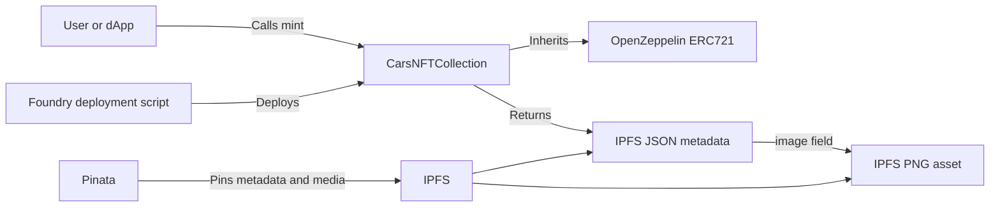
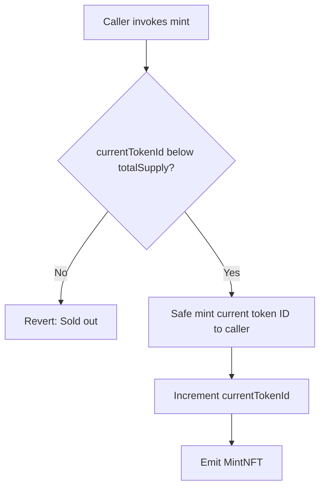
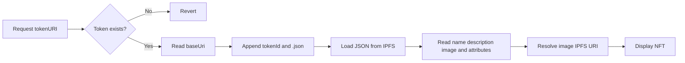
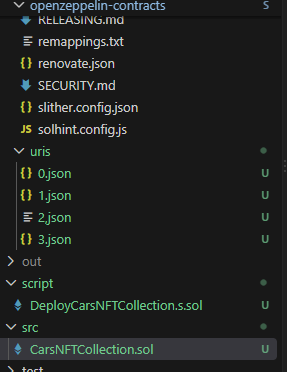
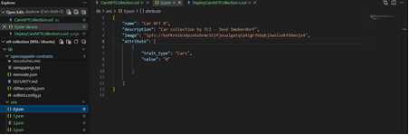
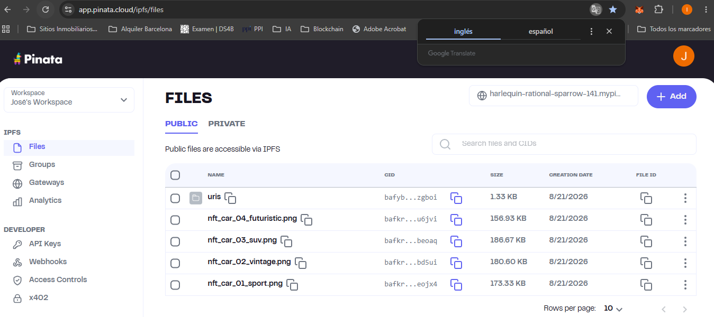
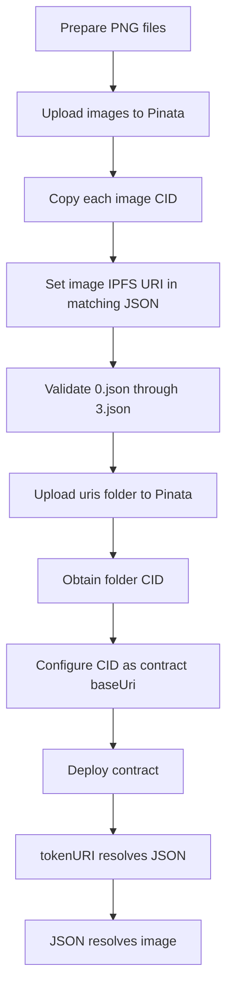
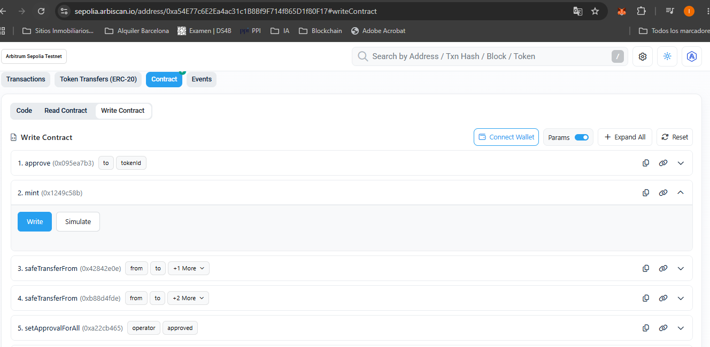

# Cars NFT Collection

A limited-supply ERC-721 collection for car-themed NFTs, built with Solidity, OpenZeppelin Contracts, and Foundry. The contract is deployed and source-verified on Arbitrum Sepolia, while NFT metadata and media are published through IPFS using Pinata.

> **Deployment status:** Successfully deployed on **Arbitrum Sepolia** at `0xa54E77c6E2Ea4ac31c1B8Bf9F714f865D1f80F17`. Sourcify verification returned `exact_match`.

## About

Cars NFT Collection provides a public minting flow for four NFTs. Token IDs begin at `0`. Each token resolves a JSON metadata document from IPFS using `{baseUri}{tokenId}.json`, and that document references the corresponding NFT image.

| Property | Value |
|---|---|
| Collection name | `Cars NFT` |
| Symbol | `CARSNFT` |
| Maximum supply | `4` |
| Token IDs | `0` to `3` |
| Metadata files | `uris/0.json` to `uris/3.json` |
| Solidity | `0.8.35` |
| Standard | ERC-721 |
| Network | Arbitrum Sepolia |
| Chain ID | `421614` |
| License | MIT |

## Key Features

- ERC-721 implementation based on OpenZeppelin Contracts.
- Public and permissionless minting.
- Fixed maximum supply established at deployment.
- Safe minting to the caller.
- IPFS-hosted JSON metadata and PNG media.
- One metadata document per zero-based token ID.
- Custom `MintNFT` event.
- Foundry deployment and Sourcify verification workflow.

## Project Structure

```text
.
├── src/
│   └── CarsNFTCollection.sol
├── script/
│   └── DeployCarsNFTCollection.s.sol
├── uris/
│   ├── 0.json
│   ├── 1.json
│   ├── 2.json
│   └── 3.json
├── lib/
│   ├── forge-std/
│   └── openzeppelin-contracts/
├── metadata-json-example.png
├── metadata-uris-folder.png
├── pinata-ipfs-files.png
├── minting-arbiscan.png
└── README.md
```

## Architecture



## How It Works

### Minting Flow



### Metadata Resolution Flow



## NFT Metadata

The `uris` folder contains four JSON metadata documents whose file names match the collection's zero-based token IDs.



```text
uris/
├── 0.json
├── 1.json
├── 2.json
└── 3.json
```

### JSON Metadata Structure

The supplied editor screenshot shows `0.json` open in Visual Studio Code and documents the metadata schema used by the project.



The visible document contains the following top-level fields:

- `name`, identifying the NFT.
- `description`, providing a human-readable description.
- `image`, containing an `ipfs://` URI for the media asset.
- `attributes`, containing a list of trait objects.

The visible trait object uses:

- `trait_type` with the category `Cars`.
- `value` with the value `0` for the displayed token metadata.

A clean equivalent structure is:

```json
{
  "name": "Car NFT 0",
  "description": "<NFT_DESCRIPTION>",
  "image": "ipfs://<IMAGE_CID>",
  "attributes": [
    {
      "trait_type": "Cars",
      "value": "0"
    }
  ]
}
```

> The screenshot clearly establishes the schema and the displayed token value. The complete description and full image CID are not transcribed because the screenshot resolution does not make every character reliably readable. Copy those values directly from the source JSON when publishing them as text.

### Metadata URI Mapping

The deployed metadata folder CID is:

```text
bafybeiegk7stppf32zvss5fyhxwbdv7zr3qlace7uem4l75mapjb2zgboi
```

The contract base URI is:

```text
ipfs://bafybeiegk7stppf32zvss5fyhxwbdv7zr3qlace7uem4l75mapjb2zgboi/
```

| Token ID | Metadata URI |
|---:|---|
| `0` | `ipfs://bafybeiegk7stppf32zvss5fyhxwbdv7zr3qlace7uem4l75mapjb2zgboi/0.json` |
| `1` | `ipfs://bafybeiegk7stppf32zvss5fyhxwbdv7zr3qlace7uem4l75mapjb2zgboi/1.json` |
| `2` | `ipfs://bafybeiegk7stppf32zvss5fyhxwbdv7zr3qlace7uem4l75mapjb2zgboi/2.json` |
| `3` | `ipfs://bafybeiegk7stppf32zvss5fyhxwbdv7zr3qlace7uem4l75mapjb2zgboi/3.json` |

### Metadata Validation Checklist

- Keep JSON file names identical to token IDs.
- Confirm every document contains valid `name`, `description`, `image`, and `attributes` fields.
- Confirm each `image` value starts with `ipfs://` and resolves to the intended PNG.
- Check that `trait_type` and `value` are consistent across the collection.
- Validate JSON syntax before uploading the final folder.
- Pin both metadata and media because the deployed contract cannot update `baseUri`.

## Publishing with Pinata

The NFT media files and the `uris` folder were uploaded through Pinata's Public files view.



| Pinata item | Type | Size shown | Purpose |
|---|---|---:|---|
| `uris` | Folder | `1.33 KB` | Contains the four JSON metadata files. |
| `nft_car_04_futuristic.png` | PNG | `156.93 KB` | NFT media asset. |
| `nft_car_03_suv.png` | PNG | `186.67 KB` | NFT media asset. |
| `nft_car_02_vintage.png` | PNG | `180.60 KB` | NFT media asset. |
| `nft_car_01_sport.png` | PNG | `173.33 KB` | NFT media asset. |

The Pinata screenshot shows abbreviated CIDs for the image files. Full image CIDs should be copied directly from Pinata into the matching JSON documents. The exact token-to-image mapping should be validated against `0.json` through `3.json`.



Reference documentation:

- [Pinata file upload documentation](https://docs.pinata.cloud/files/uploading-files)
- [Pinata CID documentation](https://docs.pinata.cloud/ipfs-101/what-are-cids)

## Smart Contract Reference

### Constructor

```solidity
constructor(
    string memory name_,
    string memory symbol_,
    uint256 totalSupply_,
    string memory baseUri_
)
```

Initialises the ERC-721 name and symbol and stores the maximum supply and metadata base URI.

### Public State

| Variable | Type | Description |
|---|---|---|
| `currentTokenId` | `uint256` | Next token ID to mint. |
| `totalSupply` | `uint256` | Maximum number of mintable tokens. |
| `baseUri` | `string` | Base path for token metadata. |

### `mint()`

```solidity
function mint() external
```

Mints the next token to `msg.sender`. The call reverts with `" Sold out"` when supply is exhausted. No contract-level mint price is implemented.

### `tokenURI(uint256 tokenId)`

```solidity
function tokenURI(uint256 tokenId)
    public view virtual override returns (string memory)
```

Checks that the token exists and returns `{baseUri}{tokenId}.json`.

### Event

```solidity
event MintNFT(address userAddress_, uint256 tokenId_);
```

## Build and Deploy

```bash
forge clean
forge build
forge test
forge script script/DeployCarsNFTCollection.s.sol \
  --rpc-url https://sepolia-rollup.arbitrum.io/rpc \
  --broadcast \
  --verify
```

Never commit a private key or populated `.env` file.

## Deployment and Verification

| Item | Value |
|---|---|
| Contract | `CarsNFTCollection` |
| Address | `0xa54E77c6E2Ea4ac31c1B8Bf9F714f865D1f80F17` |
| Transaction | `0x80158ba9c8580f1482ba9d597e53bc417559e6be222c1df48497066759243069` |
| Block | `300447962` |
| Compiler | `0.8.35` |
| EVM version | `osaka` |
| Gas used | `2,102,765` |
| Amount paid | `0.00004210576636 ETH` |
| Verification provider | Sourcify |
| Verification status | `exact_match` |
| Verification job ID | `8b47976c-c1e1-44f6-bed2-9ad2178ff345` |

[View the Sourcify verification job](https://sourcify.dev/server/v2/verify/8b47976c-c1e1-44f6-bed2-9ad2178ff345)

## Mint Through Arbiscan

[Open CarsNFTCollection on Arbiscan](https://sepolia.arbiscan.io/address/0xa54E77c6E2Ea4ac31c1B8Bf9F714f865D1f80F17#writeContract)



1. Connect a wallet configured for Arbitrum Sepolia.
2. Ensure the wallet has sufficient Arbitrum Sepolia test ETH for gas.
3. Open `mint` and optionally simulate the call.
4. Select **Write** and approve the transaction.
5. Inspect the confirmed transaction and `MintNFT` event.

[View CarsNFTCollection on Arbitrum Sepolia Blockscout](https://arbitrum-sepolia.blockscout.com/address/0xa54E77c6E2Ea4ac31c1B8Bf9F714f865D1f80F17)

## Review Notes

- Minting is public and permissionless.
- The contract has no mint fee or withdrawal mechanism.
- Supply and base URI cannot be changed after deployment.
- Token IDs are zero-based.
- Metadata presentation depends on IPFS availability.
- There is no ownership, pause, allowlist, royalty, or administrative mint mechanism.
- `_safeMint` runs before `currentTokenId` is incremented. Add contract-recipient and reentrancy-oriented tests before production use.
- The constructor accepts zero supply and an empty URI.
- The sold-out revert message contains a leading space.
- The reviewed files do not include an automated test suite.

These notes are technical observations, not a formal security audit.

## License

MIT

## Author

**Jose L. Imoberdorf**

## Acknowledgements

OpenZeppelin Contracts, Foundry, Pinata, Sourcify, Arbiscan, Blockscout, and Arbitrum Sepolia.
